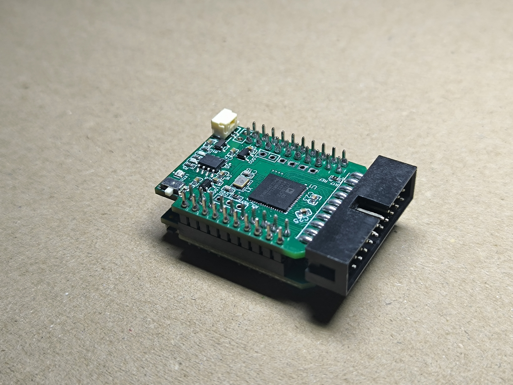
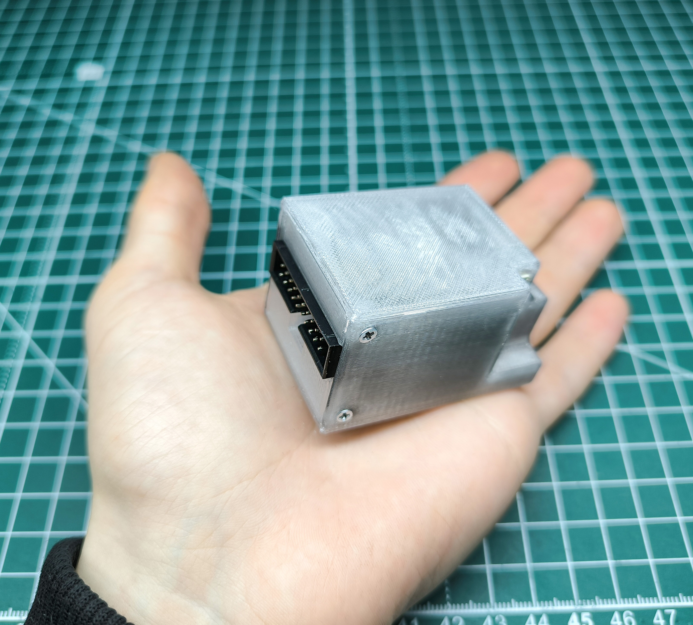
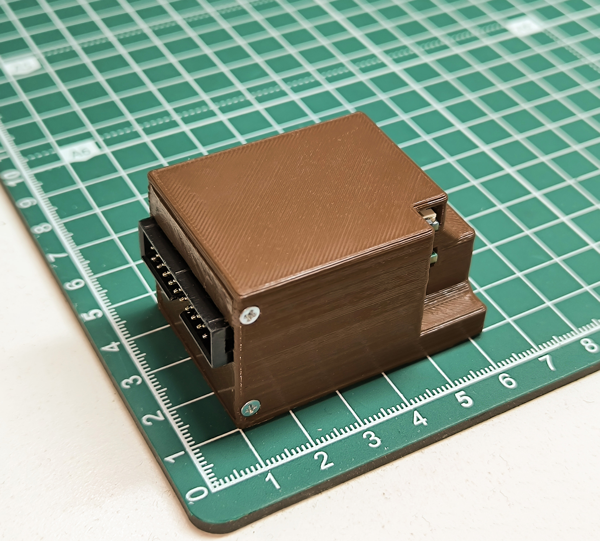
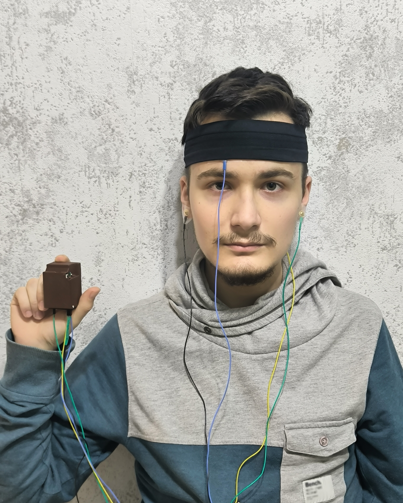

# BioListener

BioListener is an open-source project designed to revolutionize biosensing with portable, affordable, multi-channel
biosensing boards.

  

Powered by the ESP32 microcontroller, BioListener boards enable real-time data transfer via Wi-Fi, Bluetooth, and BLE,
as well as on-board signal processing. These passive electrode-based boards are versatile tools for education, research,
and innovation. At an estimated cost of **just $30 per 8-channel board**, BioListener offers an unparalleled alternative
to costly devices like OpenBCI Cyton, which are often limited to one per group due to budget constraints.  
  
**With BioListener, everyone can have access to their own device, fostering hands-on learning and experimentation.** This
democratization of biosensing technology supports applications in neurorehabilitation, VR, gaming, assistive
technologies, and beyond.

  
  

The project has already completed the initial prototyping phase, delivering two functional PCB designs (each utilizing a
different ADC chip to ensure resilience against global chip shortages). Pre-evaluation results show significant promise.

  

---

## Project Overview

### Key Features

- **Affordable & Accessible**: $30 per 8 channel board, democratizing biosensing technology.
- **Easy to Use**: Passive electrode-based boards, easy setups, integration to popular BCI and biosignals processing frameworks.
- **Resilient Design**: Two distinct board designs utilizing AD7771 and ADS131M08 ADC chips.
- **High Connectivity, Real Time Data transfer**: Powered by ESP32 for Wi-Fi, Bluetooth, and BLE communication. SD card support for offline data recording.
- **Customizability**: Modular add-ons for extended functionality. One of the boards (based on ADS131M08) includes built-in 6DOF IMU for motion tracking, and any other IMU can be easily added as an extension to any board.
- **Portable**: Compact size with 3D-printed enclosures. Total weight of the board with battery and 3D-printed enclosure is only **54g**.
- **Low Power Consumption**: Optimized for long battery life. 4 hours of continuous operation with a 700mAh battery at the highest sampling rate and data transfer via Wi-Fi at highest TX power. Up to 1400mAh battery can fit in the enclosure, and with use of Bluetooth or BLE (or offline data recording), the battery life can be extended to entire day.
- **Versatile**: Supports EEG, EMG, ECG, EOG, and other biosignal capture applications.
- **High Resolution**: 24-bit ADCs for precise signal capture.
- **High Sampling Rate**: Up to 8 channels at 2000Hz per channel at current firmware version. Basic speed: 500Hz per channel, 8 channels.
- **Usability**: Incorporates both hardware and software for a seamless user experience. Has a built-in battery charger, and can be charged and programmed via USB-C. Indication available as well.

### Supported Applications

BioListener is optimized for capturing biosignals in diverse scenarios, supporting use for both real-time data analysis
and recording:

- **EEG**: Electroencephalography for real-time brainwave capture.
- **EMG**: Electromyography for muscle activity detection.
- **ECG**: Electrocardiography for single- and multi-lead cardiac signal capture.
- **EOG**: Electrooculography for eye movement detection and analysis.

#### Demonstration
For all experimental setups evaluated, see the [BioListener Evaluation](https://github.com/serhii-matsyshyn/biolistener_evaluation) repository.

Example of simple EEG, EMG gold cup passive electrodes setup for Alpha Brain Wave and Eye Blink Detection:

  

---

## Repositories Overview

| Repository Name                                                                                    | Description                                                                                                        | Links                                                                          |
|----------------------------------------------------------------------------------------------------|--------------------------------------------------------------------------------------------------------------------|--------------------------------------------------------------------------------|
| **[BioListener Evaluation](https://github.com/serhii-matsyshyn/biolistener_evaluation)**           | Scripts, data, and experimental setups for evaluating BioListener hardware performance and real-world use.         | [View Repository](https://github.com/serhii-matsyshyn/biolistener_evaluation)  |
| **[BioListener Hardware](https://github.com/serhii-matsyshyn/biolistener_hardware)**               | Contains PCB source files, schematics, BOMs, and fabrication files for BioListener boards.                         | [View Repository](https://github.com/serhii-matsyshyn/biolistener_hardware)    |
| **[BioListener 3D Models](https://github.com/serhii-matsyshyn/biolistener_3d_models)**             | Includes Fusion360 sources and STL files for 3D-printed models for BioListener boards, such as 3D case model, etc. | [View Repository](https://github.com/serhii-matsyshyn/biolistener_3d_models)   |
| **[BioListener Firmware](https://github.com/serhii-matsyshyn/biolistener_firmware)**               | Firmware for the ESP32-based BioListener device.                                                                   | [View Repository](https://github.com/serhii-matsyshyn/biolistener_firmware)    |
| **[BioListener fork of BrainFlow](https://github.com/serhii-matsyshyn/biolistener_brainflow)**     | Fork of BrainFlow with BioListener support.                                                                        | [View Repository](https://github.com/serhii-matsyshyn/biolistener_brainflow)   |
| **[BioListener fork of OpenBCI GUI](https://github.com/serhii-matsyshyn/biolistener_OpenBCI_GUI)** | Fork of OpenBCI GUI with BioListener support.                                                                      | [View Repository](https://github.com/serhii-matsyshyn/biolistener_OpenBCI_GUI) |

---

## Current Progress

- **PCB Prototyping**: Two functional board designs with promising pre-evaluation results.
- **3D Models**: Enclosures designed for portability and durability.
- **Integration**: Work underway to integrate with BrainFlow and other popular frameworks.
- **Firmware Development**: Initial firmware development for Wi-Fi real-time data transfer to BrainFlow server.
- **Evaluation**: Initial evaluation scripts and data collection for performance analysis, both in the lab for quality evaluation and real-world scenarios. They are very promising, see according repository for more details.

---

## TODOs (Roadmap & Future Plans)

- **Testing & Validation**
  - [x] Add Jupiter notebook for evaluation
  - [x] Create connection schematic for evaluation steps
  - [x] Add evaluation results to README
  - [x] Add evaluation setup images
  - [ ] Describe evaluation process
  - [ ] Finish documenting standardized testing procedures to ensure reliability in real-world applications.
  - [ ] Compare prototypes with high-cost solutions.

- **Firmware Development**
  - [ ] Enhance features for offline mode and unstable network handling.
  - [ ] Implement auto device discovery using mDNS and DNS-SD for easy setup.
  - [ ] Optimize firmware for IoT applications and daisy-chaining (up to 16 channels).
  - [ ] Develop plug-and-play apps for educational and research use.

- **Hardware Development**
  - [ ] Finalize PCB designs for mass production.
  - [ ] Produce additional prototypes.
  - [ ] Refine 3D-printed enclosures for better portability and durability.
  - [ ] Develop modular add-ons like bio-feedback-based electrical stimulation boards.
  - [ ] Explore additional ADC chips for broader compatibility.

- **Documentation**
  - [ ] Create step-by-step guides for hardware assembly and firmware setup.
  - [ ] Develop tutorials and case studies for various use cases.
  - [ ] Provide troubleshooting documentation for common issues.

---

## Licensing

BioListener is fully open-source, with repositories licensed as follows:

- **Code**: [GNU General Public License v3.0 (GPL-3.0)](https://www.gnu.org/licenses/gpl-3.0.html).
- **Hardware Designs**: [CERN Open Hardware Licence, Version 2 - Strongly Reciprocal](https://cern-ohl.web.cern.ch/).
- **Experimental Data**: [Creative Commons Attribution 4.0 International (CC BY 4.0)](https://creativecommons.org/licenses/by/4.0/).
- **Documentation**: [Creative Commons Attribution 4.0 International (CC BY 4.0)](https://creativecommons.org/licenses/by/4.0/).

---

For questions, contributions, or discussions, feel free to create an issue or pull request in the respective
repositories.
